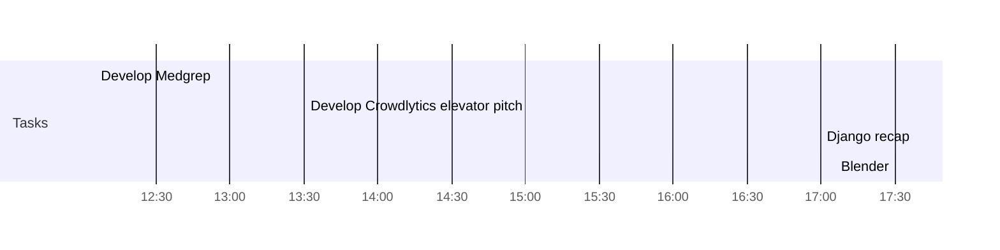

## Day Planner

```mermaid
gantt
    dateFormat  HH-mm
    axisFormat %H:%M
    %% Current Time: 12:02:57 PM
    section Tasks
    Develop Medgrep     :12-05, 85mm
    Develop Crowdlytics elevator pitch     :13-30, 210mm
    Django recap     :17-00, 30mm
    Blender     :17-30, 0mm
    section Breaks

```

## Work Morning
- [ ] 12:05 Develop Medgrep
- [ ] 13:30 Develop Crowdlytics elevator pitch
14:30

## School Afternoon
- [ ] 17:00 Django recap
- [ ] 17:30 Blender