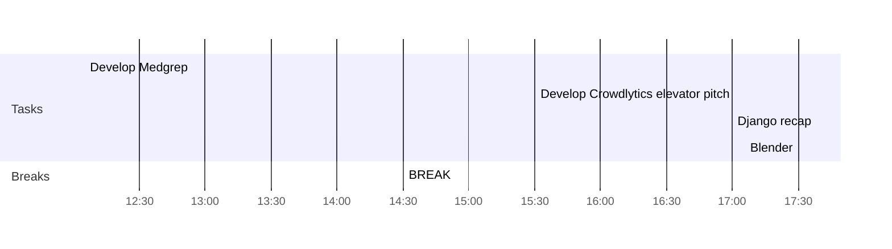

## Day Planner

```mermaid
gantt
    dateFormat  HH-mm
    axisFormat %H:%M
    %% Current Time: 6:32:55 PM
    section Tasks
    Develop Medgrep     :12-05, 145mm
    Develop Crowdlytics elevator pitch     :15-30, 90mm
    Django recap     :17-00, 30mm
    Blender     :17-30, 0mm
    section Breaks
    BREAK     :14-30, 60mm
```

## Morning Work
- [x] 12:05 Develop Medgrep
- [x] 14:30 BREAK

## Afternoon School
- [x] 15:30 Develop Crowdlytics elevator pitch
- [x] 17:00 Django recap
- [x] 17:30 Blender