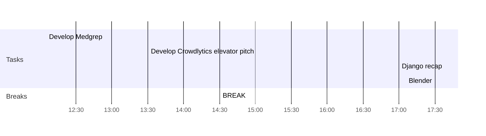

## Day Planner

```mermaid
gantt
    dateFormat  HH-mm
    axisFormat %H:%M
    %% Current Time: 12:12:07 PM
    section Tasks
    Develop Medgrep     :12-05, 85mm
    Develop Crowdlytics elevator pitch     :13-30, 60mm
    Django recap     :17-00, 30mm
    Blender     :17-30, 0mm
    section Breaks
    BREAK     :14-30, 150mm
```

## Morning Work
- [ ] 12:05 Develop Medgrep
- [ ] 13:30 Develop Crowdlytics elevator pitch
- [ ] 14:30 BREAK

## Afternoon School
- [ ] 17:00 Django recap
- [ ] 17:30 Blender