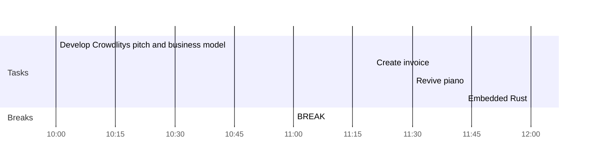

## Day Planner

```mermaid
gantt
    dateFormat  HH-mm
    axisFormat %H:%M
    %% Current Time: 11:08:22 AM
    section Tasks
    Develop Crowdlitys pitch and business model     :10-00, 60mm
    Create invoice     :11-20, 10mm
    Revive piano     :11-30, 30mm
    Embedded Rust     :12-00, 0mm
    section Breaks
    BREAK     :11-00, 20mm
```

- [x] 10:00 Develop Crowdlitys pitch and business model
- [ ] 11:00 BREAK
- [ ] 11:20 Create invoice
- [ ] 11:30 Revive piano
- [ ] 12:00 Embedded Rust